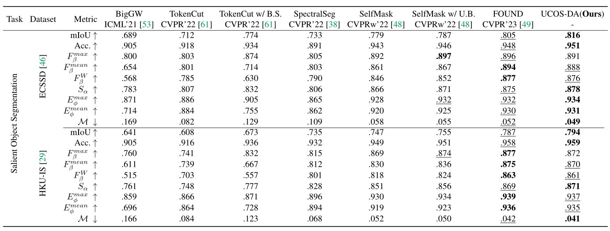
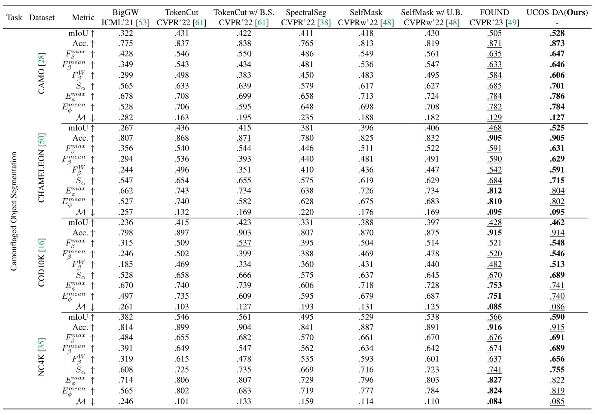
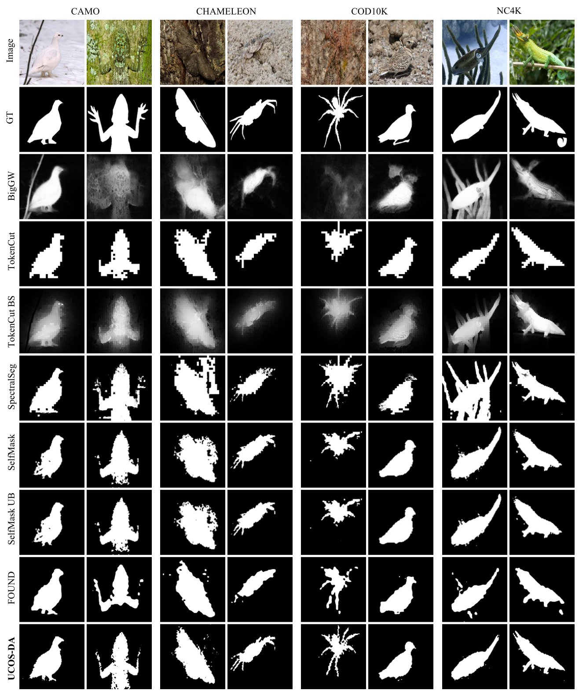

# [Unsupervised Camouflaged Object Segmentation as Domain Adaptation (ICCV 2023 Workshop on OOD-CV)](https://arxiv.org/abs/2308.04528)

Authors: [*Yi Zhang*](https://scholar.google.com/citations?user=NeHBHVUAAAAJ&hl=en), *Chengyi Wu*

---
## Introduction

In this work, we investigate a new task, namely unsupervised camouflaged object segmentation (UCOS), where the target objects own a common rarely-seen attribute, i.e., camouflage. Unsurprisingly, we find that the state-of-the-art unsupervised models struggle in adapting UCOS, due to the domain gap between the properties of generic and camouflaged objects. To this end, we formulate the UCOS as a source-free unsupervised domain adaptation task (UCOS-DA), where both source labels and target labels are absent during the whole model training process. Specifically, we define a source model consisting of self-supervised vision transformers pre-trained on ImageNet. On the other hand, the target domain includes a simple linear layer (i.e., our target model) and unlabeled camouflaged objects. We then design a pipeline for foreground-background-contrastive self-adversarial domain adaptation, to achieve robust UCOS. As a result, our baseline model achieves superior segmentation performance when compared with competing unsupervised models on the UCOS benchmark, with the training set which’s scale is only one tenth of the supervised COS counterpart.

---
## Benchmark Results 

      
    <em> 
    Figure 1: Comparison of our UCOS-DA and state-of-the-art unsupervised methods on salient object segmentation benchmark datasets. The best and the second best results of each row are highlighted.
    </em>

      
    <em> 
    Figure 2: Comparison of our UCOS-DA and state-of-the-art unsupervised methods on camouflaged object segmentation benchmark datasets. The best and the second best results of each row are highlighted.
    </em>

      
    <em> 
    Figure 3: Visual samples of our baseline model (UCOS-DA) and all competing models.
    </em>

The whole UCOS benchmark results can be downloaded at [Google Drive](https://drive.google.com/file/d/1d2nyRB9nLgkk9OhqWz9ftt2c266hl5ah/view?usp=sharing).

Please refer the [eval](https://github.com/Jun-Pu/UCOS-DA/blob/main/eval/evaluators.py) for the evaluation code.

---
## Baseline Model Implementation

Please refer to [src](https://github.com/Jun-Pu/UCOS-DA/tree/main/src) for the code of our baseline model.

The results of our baseline model upon six benchmark datasets can be downloaded at [Google Drive](https://drive.google.com/file/d/1NzGFcithFHPF18k6NUt4valLVD7N3ueb/view?usp=sharing).

The pre-trained model can be downloaded at [Google Drive](https://drive.google.com/file/d/1KubZTnGlNEUOyuZjrMpvii1uZnq_vW19/view?usp=sharing).

---
## Citation

    @article{zhang2023unsupervised,
         title={Unsupervised Camouflaged Object Segmentation as Domain Adaptation},
         author={Zhang, Yi and Wu, Chengyi},
         journal={arXiv preprint arXiv:2308.04528},
         year={2023}
    }
